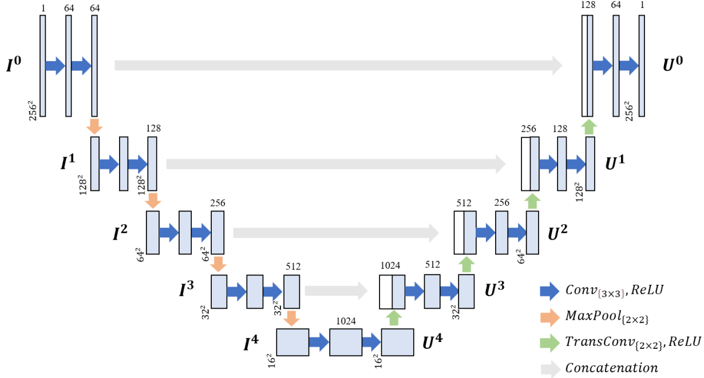

# EU-Net

This is the repo for an enhanced version of U-Net, namely EU-Net

<div align="center">
  
</div>

## Environment
* OS: Ubuntu 22.04.5 LTS
* CPU: 512 vCPU AMD EPYC 9755 128-Core Processor @ 2.70GHz
* GPU: NVIDIA H200 GPU
* CUDA: 12.9

## Dataset
The dataset (~3GB) is available at:
- [Google Drive](https://drive.google.com/drive/folders/1mY-mPcIdCMBjphVlVTclLrv-kY_N86v6?usp=drive_link)

## Run the code
```bash
python eunet.py 
```